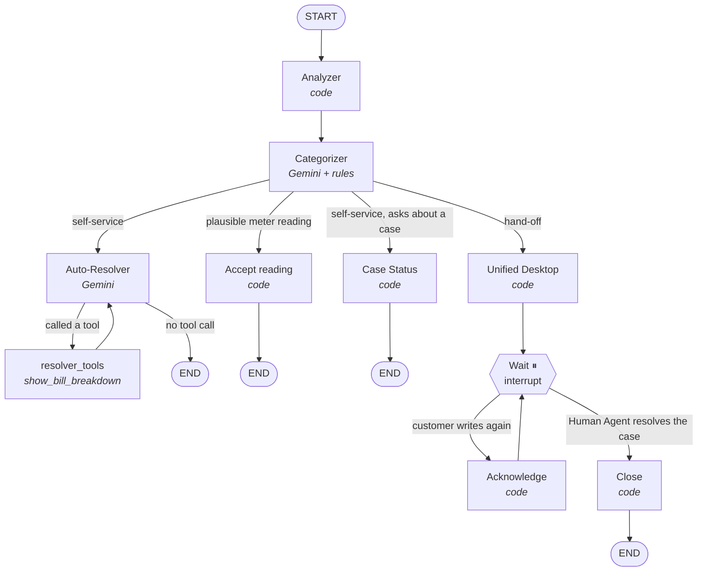

# northwind-backend

The backend for Northwind's support chat widget and agent desk
([northwind-frontend](https://github.com/MAT-HTH3/northwind-frontend)). For every customer
message, a LangGraph agent on Gemini decides whether the **AI Assistant** can fully resolve it
(a **Self-service request**) or whether a **Human Agent** must take it (a **Hand-off request**).
When a person takes it, they see the whole customer on one screen instead of four legacy systems,
and the customer never has to explain twice.

Domain vocabulary (Support Case, Case Outcome, Triage Rules, …) is defined in
[`CONTEXT.md`](CONTEXT.md).

## Run it

Requires [uv](https://docs.astral.sh/uv/) (it installs Python 3.14 for you).

```bash
cp .env.example .env          # then set GEMINI_API_KEY
uv sync
uv run alembic upgrade head
uv run uvicorn src.main:app --reload
```

Or with Docker: `docker compose up -d --build` (reads `.env`, keeps the databases in a volume).

The API is on http://localhost:8000 (interactive docs at `/docs`). Point the widget and the
agent desk at it by setting `NEXT_PUBLIC_USE_MOCK_API=false` in the front-end's `.env.local`.

Two Gemini models are used, set in `.env`:

| Setting | Default | Used by |
|---|---|---|
| `GEMINI_MODEL` | `gemini-3.5-flash-lite` | the **Categorizer** (classifying) |
| `GEMINI_RESOLVER_MODEL` | `gemini-3.5-flash` | the **Auto-Resolver** (writing replies, choosing cards) |

On first start the agent desk's invented demo data is loaded (`src/desk/desk-seed.json.gz`,
exported from the front-end's seed generator; its times are moved to now). The desk's "Reset demo
data" button (`POST /api/agent/demo/reset`) clears every chat, case and chat memory and reloads it.

### Try it

Everything runs against one invented customer, `ACC-DEMO01` (Sarah Whitfield, North).

```bash
chat() {
  curl -sN localhost:8000/api/chat -H 'Content-Type: application/json' -d "{
    \"conversation_id\": \"$1\", \"account_id\": \"ACC-DEMO01\",
    \"messages\": [{\"role\": \"user\", \"content\": \"$2\"}]}"
}
chat test-1 "Why is my bill so high?"       # Auto-Resolver shows the bill card
chat test-2 "My meter says 48213"           # reading accepted, bill re-priced
chat test-3 "We have no power at all"       # hand-off: a High urgency case, conversation held

# answer "Did this solve your problem?" (a "No" sends the next message to a person)
curl -s -X POST localhost:8000/api/conversations/test-1/resolution \
  -H 'Content-Type: application/json' -d '{"account_id": "ACC-DEMO01", "resolved": false}'

# resolve a case as a Human Agent (releases every conversation it holds)
curl -s -X PATCH localhost:8000/api/agent/cases/NW-123456 \
  -H 'Content-Type: application/json' -d '{"status": "resolved", "resolution": "bill_corrected"}'

# start again
curl -s -X POST localhost:8000/api/agent/demo/reset
```

Or use the widget (`localhost:3000`) and the desk (`localhost:3000/agent`).

## How the agent works



Only two nodes call Gemini: the **Categorizer** and the **Auto-Resolver**. Everything the
customer sees with a number in it comes from code.

### One chat message, one run

The graph runs **once per chat message**. The widget's `conversation_id` is the LangGraph
`thread_id`, and the checkpointer (`checkpoints.db`) is the conversation's memory.

```
POST /api/chat
  └─ _start_turn          record the conversation; take a pending "No" (applies once)
  └─ turn_input           held?  → Command(resume={"kind": "customer_message", ...})   → goes straight to Wait
                          not held → {"messages": [HumanMessage], "account_id", "conversation_id", force_handoff?}
  └─ graph.astream(...)   → mapped to SSE events (see "What streams to the widget")
  └─ _finish_turn         record the topic and any Support Case on the conversation
```

The *held or not* check in `turn_input` (`src/agent/turns.py`) matters: **starting a new run on
a paused thread silently discards the pause**, and the Human Agent could no longer resume it.
That is why the hold is a loop at the Wait node, not a check at the start.

### The state (`src/agent/state.py`)

| Field | Set by | Meaning |
|---|---|---|
| `messages` | everyone | The conversation (appended). |
| `account_id`, `conversation_id` | chat endpoint | Who and which thread. |
| `history` | Analyzer | The Unified Customer History as JSON. Read it with `history_from(state)`. |
| `force_handoff` | chat endpoint (after a "No") | Forces this one message to a person; the Categorizer clears it. |
| `is_self_service`, `category`, `subject` | Categorizer | The decision for this message. |
| `meter_reading` | Categorizer | `{"service", "value"}` if the customer typed a meter reading. |
| `reading_check` | Categorizer | `"accepted"` or `"needs_review"`, decided by code. |
| `disputed_amount` | Categorizer | Pounds, only if the customer typed one. |
| `case_status_request` | Categorizer | The customer is asking about an existing case. |
| `topic` | answering node | What answered, in the desk's words ("Bill explained"). |
| `case_id` | Unified Desktop / Close | The case holding this conversation (None once closed). |
| `case_outcome` | Wait → Close | The resolution code the Human Agent picked. |

### The nodes

#### Analyzer (`src/history/builder.py`), code only

Builds the **Unified Customer History** every turn:
1. Reads **CRM** first, because only CRM knows the other systems' ids for this customer.
2. Then fetches **Legacy Billing**, both **meters**, **CaseTrack**, and **our Support Cases and
   readings**, all at once.
3. Normalises everything: pence → £, `DDMMYYYY` → dates, litres → m³, codes → plain labels, and
   works out six months of usage from the meter reads.

It runs every turn, so the history is never stale. It is **not sent to the model**: code uses it
for cards, triage, re-pricing and case replies.

#### Categorizer (`src/agent/categorizer.py`), Gemini + rules

Gemini (`GEMINI_MODEL`) reads **only the conversation** (the last ~12 messages, starting at a
customer message) and returns:

| Output | Values |
|---|---|
| `is_self_service` | true: explain a bill, payment date, ask about a case, greetings. false: repair or supply problem, refund / dispute / payment plan, asks for a person, says the AI didn't help. |
| `category` | Billing · Meter reading · Payments · Supply · Water quality · Service |
| `subject` | a case title from a closed list per category (`src/agent/categories.py`) |
| `meter_reading` | only a number from the meter display (not a bill amount or phone number) |
| `disputed_amount` | only money the customer says is wrong or wants back |
| `case_status_request` | asking about an existing case or complaint |

Then **code applies the rules the model may not overrule**:
- A meter reading → category **Meter reading**, subject "Reading needs checking".
- After a **"No"** (`force_handoff`) → always a hand-off. Gemini still picks the category.
- The subject must belong to the category, otherwise the category's catch-all is used.
- **The reading check** (`src/agent/readings.py`): the reading is *plausible* if it is above the
  last **actual** reading, above the reading the current bill **opened** with, and no more than
  **2,000 kWh** (100 m³ for water) above that opening reading. Plausible →
  `reading_check = "accepted"` (self-service); otherwise `"needs_review"` (hand-off).
- If Gemini fails while an override applies, the hand-off still happens (Service, "Asked for a
  person"). Without an override the error goes to the widget as a polite `error` event.

#### Router (`route_after_categorizer`), in this order

1. `reading_check == "accepted"` → **Accept reading**
2. not self-service → **Unified Desktop**
3. `case_status_request` → **Case Status**
4. otherwise → **Auto-Resolver**

#### Accept reading, code only

Saves the reading as `accepted` (no case), re-prices the latest bill with the actual usage
(usage = reading − opening reading; VAT follows energy), and replies with a **receipt card**
(`status: "accepted"`, `revised_amount_due`) plus fixed text. Ends. The bill card afterwards
shows the re-priced bill.

#### Case Status (`src/agent/case_status.py`), code only

Answers from the history, never the model:
- **Open cases** (up to three): "Your case **NW-…** is with our billing team (in progress).
  They'll reply by **Tuesday 6 October**."
- **Latest resolved case**: "Your case **NW-…** was resolved on **…**: we corrected your bill."
- **No Support Cases, but a CaseTrack case**: "Your most recent one, **CT-88123** … was closed on
  **Wednesday 19 August**…"
- **Nothing**: an offer to put them through to a person.

#### Auto-Resolver (`src/agent/auto_resolver.py`) ⇄ `resolver_tools`, Gemini

Gemini (`GEMINI_RESOLVER_MODEL`) answers with the conversation only. It has one tool:

**`show_bill_breakdown(month?)`** (`src/agent/tools.py`) builds the full bill card in code
(lines, rates, six months of usage, the change reasons, rate changes, balance) and returns
**two things**: the model gets `"The bill is now shown to the customer on a card."`; the widget
gets the whole card as the tool's `artifact`. `month` is `YYYY-MM` (for "my August bill"). An
unknown month goes back to Gemini as an error that names no bills, and Gemini recovers.

The loop: Auto-Resolver → (tool call) → `resolver_tools` → Auto-Resolver → … → END when it
replies without a tool call. Its prompt forbids stating amounts, dates or readings, promising a
bill change, or ending with a question unless an answer is needed.

#### Unified Desktop (`src/agent/unified_desktop.py`), code only

Hands the request to a person:
1. **Joins** the customer's open case in the **same category** (the conversation is linked to
   it), or **creates** a new Support Case with:
   - Urgency, SLA, queue and due date from the **Triage Rules** (`src/triage/`), with the
     customer's earlier cases counted as repeat contact
   - the subject, the customer's own words as the description, the disputed amount, and
     `vulnerable` from CRM
   - a **summary written by a template** (not the model)
2. Saves an implausible reading as `needs_review` on the case.
3. Replies with fixed text and cards: the **receipt first** (if there was a reading), then the
   **case card**.
4. Goes to **Wait**.

The Triage Rules are a points scorecard: each rule that fires adds points (category base, no
supply, water quality, vulnerable customer, regulator mention, repeat contact, disputed amount,
transfers, came through the assistant). **High (P1) at 60+ points, Medium (P2) at 30+, otherwise
Low (P3)**, with SLAs of 2 / 10 / 20 days. The desk shows the same rules as "Why it's here".

#### Wait (the hold), Acknowledge, Close

- **Wait** calls `interrupt()`. The thread is paused, and the conversation is **held**.
- **Customer writes again** → the chat endpoint resumes with `{"kind": "customer_message"}` →
  **Acknowledge** stores the message on the case ("Customer added a message" on the desk) and
  replies "Your case NW-… is with our team. I've added this to it so they'll see it." → back to
  **Wait**. No model call, no new case.
- **Human Agent resolves the case** on the desk (`PATCH status=resolved`) → the backend resumes
  *every* conversation linked to the case with `{"kind": "case_closed", "outcome": …}` → **Close**
  → END. The conversation is live again; its next message runs the whole graph.

Reopening a case on the desk does **not** hold the conversations again.

## Design choices

1. **A hand-off is a real LangGraph `interrupt()`.** The conversation is *held* until a Human
   Agent resolves the case, and resolving it resumes the exact thread. One case can gather
   several conversations.
2. **The model sees only the customer's words.** No names, amounts, dates, readings, bills or
   cases ever reach Gemini, so it cannot misquote them. Figures appear only on **cards** built by
   code.
3. **Code decides meter readings.** Plausible readings are accepted and the bill re-priced
   straight away; implausible ones go to a Human Agent.
4. **The Triage Rules are shared with the desk**, so the case card the customer sees and the desk
   always agree on Urgency, queue and due date. Same input, same result, no AI.

### What the model is allowed to see

`for_model()` (`src/agent/transcript.py`) is applied before every Gemini call:

| In the conversation | What Gemini gets |
|---|---|
| Customer messages | as typed (a reading or amount *they* typed is fine) |
| The Auto-Resolver's own replies | as written (they contain no figures) |
| Tool results | the short status only, never the card |
| Replies written by code (hand-off, acknowledgement, accepted reading, case status) | a **data-free summary** in square brackets, e.g. "[The assistant passed the conversation to a person and showed the case number.]" |

The summaries matter: without them the model couldn't tell that a person was already arranged,
and treated "What happened with my case?" as another hand-off. `tests/test_model_privacy.py`
runs a whole conversation and checks that none of 24 account values reach either model.

### What streams to the widget (`src/api/streaming.py`)

| Event | Comes from |
|---|---|
| `text-delta` | Auto-Resolver tokens; the fixed text of Accept reading, Case Status, Unified Desktop and Acknowledge |
| `tool-call` | Auto-Resolver tool calls; code cards (receipt, case) carry their `result` directly |
| `tool-result` | the tool's `artifact` (the full card), `is_error` for a missing bill |
| `done` / `error` | end of the reply / a customer-safe message (no internals) |

Tokens from the Categorizer's own LLM call never stream; only listed nodes reach the customer.

## Endpoints

The full contract is in the front-end's
[`docs/api-contract.md`](https://github.com/MAT-HTH3/northwind-frontend/blob/master/docs/api-contract.md).

| Endpoint | Used by | What it does |
|---|---|---|
| `GET /api/customers/{account_id}` | widget | Profile for the greeting (from CRM). |
| `POST /api/chat` | widget | Runs the graph for one message and streams Server-Sent Events. |
| `POST /api/conversations/{id}/resolution` | widget | The answer to "Did this solve your problem?". A "No" forces the next message to a person. |
| `GET /api/agent/queue` | desk | Open cases, cases closed in the last 90 days, recent conversations and feedback. |
| `GET /api/agent/cases/{id}` | desk | One case: transcript, account snapshot, timeline, feedback. |
| `GET /api/agent/conversations/{id}` | desk | One chat conversation and its transcript. |
| `PATCH /api/agent/cases/{id}` | desk | Status, assignee, urgency override, resolution. **Resolving resumes every held conversation.** |
| `POST /api/agent/cases/{id}/feedback` | desk | A Feedback Note (Human Agents only). |
| `POST /api/agent/demo/reset` | desk | Clears everything, reloads the demo seed. |

## Layout

| Path | What it is |
|---|---|
| `src/main.py` | FastAPI app, CORS, routers. |
| `src/core/` | Settings loaded from `.env`; the async SQLAlchemy engine and session. |
| `src/legacy/` | Four **mock Legacy Systems** (Legacy Billing, Metering, CRM, CaseTrack), each with its own deliberately different data format, plus their fixtures. |
| `src/history/` | The **Unified Customer History**: one merged view of all four systems plus our own Support Cases. |
| `src/agent/` | **The agent graph**: state, nodes, tools, checkpointer, turn helpers. |
| `src/triage/` | The **Triage Rules**: a Python port of the agent desk's points scorecard, pinned to it by `tests/fixtures/triage-golden.json`. |
| `src/desk/` | What the agent desk needs: transcripts, record mapping, the demo seed and reset. |
| `src/models/`, `src/repositories/` | The tables we own and the only code that touches them (repository methods flush; callers commit). |
| `src/schemas/` | Request and response models shared with the widget contract. |
| `src/api/routes/` | The HTTP endpoints. |
| `alembic/` | Database migrations. |

The database is SQLite for now. The schema is kept Postgres-compatible, so moving to
Postgres (Tiger Data) means changing `DATABASE_URL` to a `postgresql+asyncpg://` URL.

## Develop

```bash
uv run pytest                              # fast; Gemini is faked (tests/fakes.py)
RUN_LIVE_LLM=1 uv run pytest -k live       # real Gemini calls to check the prompts
uv run ruff check . && uv run ruff format .
uv run alembic revision --autogenerate -m "describe the change"
```

| Area | Tests |
|---|---|
| Graph wiring, hold, close, restart | `test_support_graph.py` |
| Analyzer / history | `test_history.py`, `test_legacy_fixtures.py` |
| Categorizer rules / live prompt | `test_categorizer.py` / `test_categorizer_live.py` |
| Auto-Resolver, bill card | `test_auto_resolver.py` / `test_auto_resolver_live.py` |
| Readings | `test_readings.py` |
| Unified Desktop, triage | `test_unified_desktop.py`, `test_triage_golden.py` |
| Case Status | `test_case_status.py` |
| Chat stream | `test_chat_api.py` |
| Resolution, conversations | `test_conversations.py` |
| Desk API, seed, reset | `test_agent_api.py`, `test_desk_seed.py` |
| Nothing from the account reaches the model | `test_model_privacy.py` |

## Changing things safely

| To change… | Edit | Also |
|---|---|---|
| What counts as self-service | `SYSTEM_PROMPT` in `src/agent/categorizer.py` | Re-run `RUN_LIVE_LLM=1 uv run pytest -k categorizer_live`. |
| How replies sound | `SYSTEM_PROMPT` in `src/agent/auto_resolver.py` | Keep the rule that it never states an amount, date or reading: figures only ever come from cards. |
| Case titles | `SUBJECTS` and `Subject` in `src/agent/categories.py` | Keep both lists in step. |
| Triage points, thresholds, queues | the frontend's `triage.ts` **and** `src/triage/rules.py` | Regenerate the golden file in the frontend (`npx tsx scripts/export-triage-golden.ts`), copy it to `tests/fixtures/`, run `test_triage_golden.py`. |
| Reading limits | `MAX_USAGE` in `src/agent/readings.py` | `test_readings.py` has the boundaries. |
| Wording of fixed replies | `unified_desktop.py`, `case_status.py`, `nodes.py` (Accept reading, Acknowledge) | If you add a code-written reply, give it a data-free `summary` (`written_by_code`). |
| Add a card tool for Gemini | `src/agent/tools.py` with `response_format="content_and_artifact"` | Add it to `AUTO_RESOLVER_TOOLS`; the widget draws only the tool names in its toolkit. |
| The demo data | the frontend's seed → `npx tsx scripts/export-desk-seed.ts` → gzip to `src/desk/desk-seed.json.gz` | Then reset the demo. |
| Customer fixtures | `src/legacy/fixtures/*.json` | `test_legacy_fixtures.py` checks the four systems agree. |
